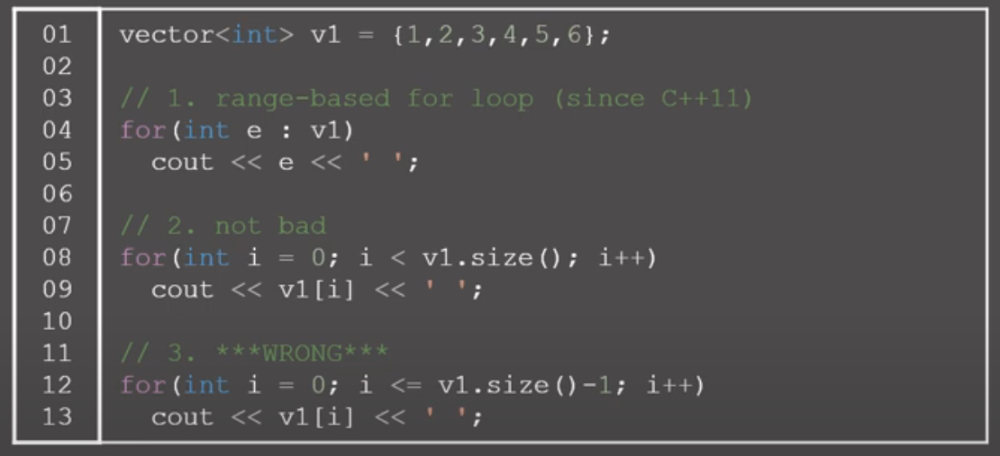

# 배열 기능과 구현

## 전체를 특정 값으로 초기화

### memset

C/C++에서 메모리 블록을 특정 값으로 초기화할 때 사용하는 함수.

```cpp
void *memset(void *ptr, int value, size_t num);
```

- ptr: 값을 채울 메모리의 시작 주소
- value: 채울 값 (단일 바이트로 취급)
- num: 채울 바이트 수

바이트 단위로 처리되므로 num에는 sizeof(arr) 형식으로 넣고, value에 0또는 -1로 채우는 게 좋음.

### for 문 사용

### algorithm의 fill 함수

```cpp
#include <algorithm>

std::fill(start_iterator, end_iterator, value);
```

- start_iterator: 채우기 시작할 반복자
- end_iterator: 채우기 끝 반복자
- value: 채울 값

# STL vector

배열과 거의 동일한 기능을 수행하는 자료구조.

- 크기를 자유자재로 조절 가능.
- `=`을 사용하면 deep copy

```cpp
// c++ 11에서 지원하는 기능
vector<int> v1= {1,2,3,4,5,6};
for(int e: v1) //e에 복사된 값이 들어감
    cout<<e<<" ";

for(int& e: v1) //실제 값이 바뀜.
    cout<<e<<" ";
```



마지막에서 v1.size가 0일 때 잘못된 결과가 반환됨. size()는 unsigned int를 반환하고 -1을 하면 overflow 때문에 4294967295가 나옴.
