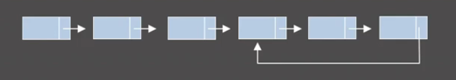

# 연습 문제

1. 원형 연결 리스트 내의 임의의 노드가 하나 주어졌을 때 해당 List의 길이를 효율적으로 구하는 방법?

동일한 노드가 나올 때까지 계속 다음 노드로 가면 됨. 공간 복잡도 O(1), 시간 복잡도 O(N)

2. 중간에 만나는 두 연결 리스트의 시작점들이 주어졌을 때 만나는 지점을 구하는 방법?

일단 두 시작점 각각에 대해 끝까지 진행시켜서 각각의 길이를 구함. 그 후 다시 두 시작점으로 돌아와서 더 긴 쪽을 둘의 차이만큼 앞으로 먼저 이동시켜놓고, 두 시작점이 만날 때까지 두 시작점을 동시에 한 칸씩 전진시키면됨. 공간 복잡도 O(1), 시간 복잡도 O(A+B).

3. 주어진 연결 리스트 안에 사이클이 있는지 판단.
   

Floyd's cycle finding algorithm 사용. 동일한 출발점에서 하나는 1칸씩, 다른 하나는 2칸씩 가게 하여 출발시킴.
공간 복잡도 O(1), 시간 복잡도 O(N).
